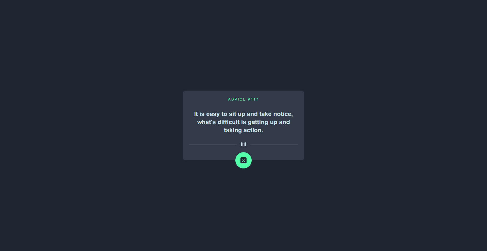

# Frontend Mentor - Advice generator app solution

This is a solution to the [Advice generator app challenge on Frontend Mentor](https://www.frontendmentor.io/challenges/advice-generator-app-QdUG-13db).

## Table of contents

- [Overview](#overview)
  - [The challenge](#the-challenge)
  - [Screenshot](#screenshot)
  - [Links](#links)
- [My process](#my-process)
  - [Built with](#built-with)
  - [What I learned](#what-i-learned)
  - [Continued development](#continued-development)
  - [Useful resources](#useful-resources)


## Overview

### The challenge

Users should be able to:

- View the optimal layout for the app depending on their device's screen size
- See hover states for all interactive elements on the page
- Generate a new piece of advice by clicking the dice icon

### Screenshot



### Links

- Solution URL: [Github](https://github.com/Nipaaaa1/advice-generator)
- Live Site URL: [Github Pages](https://nipaaaa1.github.io/advice-generator/)

## My process

### Built with

- Semantic HTML5 markup
- [React](https://reactjs.org/) - JS library
- [Tailwind CSS](https://tailwindcss.com/) - CSS Framework
- [Framer Motion](https://framer.com/motion/) - For animation


### What I learned

Finally, **Framer Motion** is such a nice library. Once you know how to use it, animating in React becomes *much* more simple.

Say that you wanna add a layout animation. Simply add `Layout` on parent element like this:
```html
<div layout className"...">
  <!-- This is the children elements -->
</div>
```

Now you have a nice animation. Also `variants` is such a nice things to have. Anyway, it's a cool library, you should try it!

### Continued development

I realize I didn't understand about API that much, so in the next challenge, I want to test my API skills if possible.

### Useful resources

- [Bobbyhadz blog](https://bobbyhadz.com/blog/react-fetch-data-on-button-click) - How to fetch data when clicking button on React.

